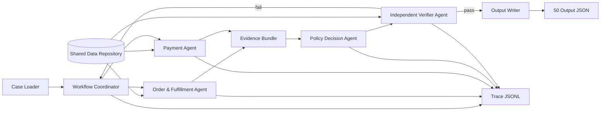

# BÁO CÁO PHÂN TÍCH VÀ KẾ HOẠCH HOÀN THÀNH ĐỀ TÀI

## Multi-Agent E-commerce Dispute Resolution

> Phạm vi báo cáo: trạng thái repository tại ngày 05/08/2026, phân tích trực tiếp 50 input chính thức và các bảng Olist hiện có. Nhóm thực hiện gồm 5 thành viên.

## 1. Kết luận nhanh

Đề tài yêu cầu xây dựng một hệ thống **multi-agent có phân công và handoff thật** để xử lý 50 khiếu nại thương mại điện tử. Hệ thống phải đọc dữ liệu Olist, áp dụng chính sách `EC_POLICY_V1`, sinh đúng 50 JSON, ghi trace chạy thật và cung cấp tài liệu kiến trúc/báo cáo cá nhân.

Repo hiện có đầy đủ 9 CSV Olist và 50 input chính thức, nhưng **chưa có source code**, chưa có output, `architecture.md` đang rỗng, `logging/metadata.json` và `logging/trace.jsonl` đang rỗng. Vì vậy repo hiện **chưa ở trạng thái có thể nộp chấm điểm**.

Kết quả đối soát trực tiếp 50 case:

| Chỉ số | Kết quả |
| --- | ---: |
| Tổng số case / order duy nhất | 50 / 50 |
| Case cần hoàn tiền (`action_required`) | 32 |
| Case không hoàn tiền (`no_action`) | 18 |
| Tổng refund suy ra từ policy | 3,429.64 BRL |
| Số item tối đa trong một case | 3 |
| Số seller tối đa trong một case | 1 |
| Số payment row tối đa trong một case | 3 |

## 2. Mục tiêu và deliverable bắt buộc

Với mỗi file `data/input/EC_NNN.json`, pipeline phải:

1. Lấy `claimed_order_id` và truy xuất order, item, seller, payment liên quan.
2. Đối chiếu trạng thái đơn, mốc giao hàng, hạn seller bàn giao và số tiền.
3. Áp dụng 6 rule của `EC_POLICY_V1` **đúng thứ tự ưu tiên**.
4. Xác định issue, case status, root cause, bên chịu trách nhiệm, evidence, refund và action.
5. Verifier kiểm tra schema, ID, giới hạn mảng, số tiền và tính nhất quán.
6. Ghi `output/EC_NNN.json` và trace handoff thực tế.

Các artifact phải hoàn thành trước khi nộp:

| Artifact | Yêu cầu | Trạng thái hiện tại |
| --- | --- | --- |
| Source code multi-agent | Model/agent, orchestration, data access, policy, validator, runner | **Chưa có** |
| `output/EC_001.json` ... `EC_050.json` | Đúng schema, đúng tên, đủ 50 file | **Chưa có** |
| `architecture.md` | Sơ đồ agent, vai trò, quyền truy cập, handoff | Có file nhưng **rỗng** |
| `logging/trace.jsonl` | Trace chạy thật của lượt chạy mới nhất, không append lịch sử cũ | Có file nhưng **rỗng** |
| `logging/metadata.json` | Model, parameter size, framework, runtime | Có file nhưng **rỗng** |
| 5 báo cáo cá nhân | Mỗi thành viên một file ở root repo, đúng phần việc thật | Mới có **1 template**, chưa điền |
| ZIP output | Chỉ gồm đúng 50 JSON cần chấm | **Chưa có** |
| Git repository | Commit đầy đủ source trước khi nộp; giữ nguyên tên repo | **Chưa có phần triển khai để commit** |

## 3. Dữ liệu đã có

### 3.1. Bộ dữ liệu Olist

Số dòng dưới đây tính cả dòng header:

| File | Số dòng | Vai trò trong đề tài |
| --- | ---: | --- |
| `olist_orders_dataset.csv` | 99,442 | Bắt buộc: trạng thái và mốc thời gian order |
| `olist_order_items_dataset.csv` | 112,651 | Bắt buộc: item, seller, shipping limit, price, freight |
| `olist_order_payments_dataset.csv` | 103,887 | Bắt buộc: các payment row và tổng payment |
| `olist_sellers_dataset.csv` | 3,096 | Kiểm chứng seller tồn tại |
| `olist_customers_dataset.csv` | 99,442 | Có sẵn nhưng không cần cho 6 rule hiện tại |
| `olist_products_dataset.csv` | 32,952 | Có sẵn nhưng không cần cho 6 rule hiện tại |
| `olist_order_reviews_dataset.csv` | 104,720 | Có sẵn nhưng không dùng để quyết định policy |
| `olist_geolocation_dataset.csv` | 1,000,164 | Có sẵn nhưng không cần cho bài chấm hiện tại |
| `product_category_name_translation.csv` | 71 | Có sẵn nhưng không cần cho bài chấm hiện tại |

Pipeline tối thiểu chỉ cần nạp `orders`, `order_items`, `order_payments`; có thể nạp `sellers` để hậu kiểm ID. Không nên đưa review, sản phẩm hay geolocation vào prompt nếu chúng không phục vụ rule vì làm tăng token, thời gian và nguy cơ suy diễn.

### 3.2. Khóa join

- `orders.order_id -> order_items.order_id`
- `orders.order_id -> order_payments.order_id`
- `order_items.seller_id -> sellers.seller_id`
- Các join khách hàng, sản phẩm, review và geolocation có trong README nhưng không bắt buộc cho quyết định của 50 case.

Lưu ý: một order có thể có nhiều item và nhiều payment row. `payment_value` là giá trị của **từng payment row**, không nhân thêm với `payment_installments`.

### 3.3. Input chính thức

- Có đúng 50 file từ `data/input/EC_001.json` đến `data/input/EC_050.json`.
- Có 50 `claimed_order_id` duy nhất và tất cả đều tìm thấy trong bảng orders.
- Tất cả dùng `policy_version = EC_POLICY_V1`, ngôn ngữ `vi`, cùng `opened_at`.
- Nội dung yêu cầu gồm 25 claim giao trễ, 16 claim đơn không hoàn tất dù đã trả tiền và 9 claim nghi bị thu trùng.

**Sai khác đường dẫn cần xử lý:** README phần Input mô tả `input/`, nhưng file thật nằm trong `data/input/`; thư mục root `input/` hiện trống. Runner phải dùng `data/input/` hoặc cho phép cấu hình đường dẫn, không được mặc định đọc thư mục trống.

## 4. Logic nghiệp vụ phải cài đặt

Các rule phải được kiểm tra theo đúng thứ tự sau; dừng tại rule đầu tiên khớp:

| Ưu tiên | Primary issue | Điều kiện | Responsible party | Refund | Action | Root cause |
| ---: | --- | --- | --- | ---: | --- | --- |
| 1 | `canceled_order_paid` | status `canceled` và payment total > 0 | `platform` / `OLIST_PLATFORM` | payment total | `issue_full_refund` | `ORDER_CANCELED_AFTER_PAYMENT` |
| 2 | `unavailable_order_paid` | status `unavailable` và payment total > 0 | `platform` / `OLIST_PLATFORM` | payment total | `issue_full_refund` | `ORDER_UNAVAILABLE_AFTER_PAYMENT` |
| 3 | `late_delivery_seller` | giao sau estimate và carrier nhận sau shipping limit của item | `seller` / seller ID vi phạm | freight total | `refund_freight` | `SELLER_HANDOFF_AFTER_LIMIT` |
| 4 | `late_delivery_logistics` | giao sau estimate và carrier nhận không muộn hơn shipping limit | `logistics_provider` / `LOGISTICS_PROVIDER` | freight total | `refund_freight` | `CARRIER_DELIVERED_AFTER_ESTIMATE` |
| 5 | `valid_split_payment` | từ 2 payment row và `abs(payment - item - freight) <= 0.10` | Không có | 0 | `explain_valid_split_payment` | `MULTIPLE_PAYMENTS_RECONCILED` |
| 6 | `unsupported_late_claim` | giao không muộn hơn estimate và payment khớp | Không có | 0 | `reject_late_refund` | `DELIVERY_WITHIN_ESTIMATE` |

Công thức chuẩn:

```text
item_total_brl       = round(sum(order_items.price), 2)
freight_total_brl    = round(sum(order_items.freight_value), 2)
payment_total_brl    = round(sum(order_payments.payment_value), 2)
payment_matches      = abs(payment_total - item_total - freight_total) <= 0.10
late_delivery        = delivered_customer_date > estimated_delivery_date
seller_handoff_late  = delivered_carrier_date > shipping_limit_date của item
```

Nên dùng `Decimal` hoặc quy tắc làm tròn tiền nhất quán để tránh lỗi số thực. Timestamp trong CSV có cùng định dạng nên có thể parse thành datetime hoặc so sánh sau khi xác thực; đề bài không yêu cầu đổi múi giờ.

## 5. Kết quả phân tích 50 case

Đây là bảng đối soát suy ra trực tiếp từ CSV và policy, dùng làm oracle nội bộ để phát triển/test. Cột refund là `recommended_refund_brl`.

| Case | Primary issue suy ra | Item rows | Payment rows | Item total | Freight | Payment | Refund |
| --- | --- | ---: | ---: | ---: | ---: | ---: | ---: |
| EC_001 | `late_delivery_seller` | 1 | 1 | 119.90 | 12.04 | 131.94 | 12.04 |
| EC_002 | `unsupported_late_claim` | 2 | 1 | 163.98 | 16.64 | 180.62 | 0.00 |
| EC_003 | `canceled_order_paid` | 1 | 1 | 100.00 | 9.34 | 109.34 | 109.34 |
| EC_004 | `valid_split_payment` | 1 | 2 | 179.90 | 32.06 | 211.96 | 0.00 |
| EC_005 | `unavailable_order_paid` | 0 | 1 | 0.00 | 0.00 | 1191.50 | 1191.50 |
| EC_006 | `valid_split_payment` | 1 | 2 | 31.90 | 12.48 | 44.38 | 0.00 |
| EC_007 | `canceled_order_paid` | 1 | 1 | 47.90 | 8.50 | 56.40 | 56.40 |
| EC_008 | `canceled_order_paid` | 1 | 1 | 213.75 | 36.82 | 250.57 | 250.57 |
| EC_009 | `late_delivery_logistics` | 1 | 1 | 122.99 | 12.36 | 135.35 | 12.36 |
| EC_010 | `late_delivery_logistics` | 1 | 1 | 19.99 | 7.78 | 27.77 | 7.78 |
| EC_011 | `unavailable_order_paid` | 0 | 1 | 0.00 | 0.00 | 142.09 | 142.09 |
| EC_012 | `late_delivery_logistics` | 1 | 1 | 105.00 | 9.67 | 114.67 | 9.67 |
| EC_013 | `unavailable_order_paid` | 0 | 1 | 0.00 | 0.00 | 619.86 | 619.86 |
| EC_014 | `valid_split_payment` | 1 | 2 | 56.99 | 15.15 | 72.14 | 0.00 |
| EC_015 | `canceled_order_paid` | 1 | 1 | 49.90 | 19.59 | 69.49 | 69.49 |
| EC_016 | `late_delivery_logistics` | 1 | 1 | 38.00 | 14.52 | 52.52 | 14.52 |
| EC_017 | `late_delivery_logistics` | 1 | 1 | 60.00 | 12.76 | 72.76 | 12.76 |
| EC_018 | `valid_split_payment` | 1 | 2 | 19.90 | 7.78 | 27.68 | 0.00 |
| EC_019 | `unavailable_order_paid` | 0 | 1 | 0.00 | 0.00 | 74.70 | 74.70 |
| EC_020 | `valid_split_payment` | 1 | 2 | 260.00 | 9.08 | 269.08 | 0.00 |
| EC_021 | `canceled_order_paid` | 1 | 1 | 29.90 | 8.96 | 38.86 | 38.86 |
| EC_022 | `late_delivery_seller` | 1 | 1 | 249.00 | 19.98 | 268.98 | 19.98 |
| EC_023 | `unsupported_late_claim` | 1 | 1 | 59.90 | 13.44 | 73.34 | 0.00 |
| EC_024 | `unavailable_order_paid` | 0 | 1 | 0.00 | 0.00 | 87.08 | 87.08 |
| EC_025 | `valid_split_payment` | 3 | 2 | 133.05 | 51.27 | 184.32 | 0.00 |
| EC_026 | `canceled_order_paid` | 1 | 1 | 129.90 | 12.44 | 142.34 | 142.34 |
| EC_027 | `unavailable_order_paid` | 0 | 1 | 0.00 | 0.00 | 74.70 | 74.70 |
| EC_028 | `unavailable_order_paid` | 0 | 1 | 0.00 | 0.00 | 61.19 | 61.19 |
| EC_029 | `late_delivery_seller` | 3 | 1 | 449.70 | 42.51 | 492.21 | 42.51 |
| EC_030 | `valid_split_payment` | 1 | 3 | 15.90 | 9.94 | 25.84 | 0.00 |
| EC_031 | `late_delivery_logistics` | 1 | 1 | 82.00 | 7.44 | 89.44 | 7.44 |
| EC_032 | `unsupported_late_claim` | 2 | 1 | 238.00 | 29.66 | 267.66 | 0.00 |
| EC_033 | `late_delivery_seller` | 1 | 1 | 120.00 | 18.72 | 138.72 | 18.72 |
| EC_034 | `late_delivery_seller` | 1 | 1 | 110.00 | 36.43 | 146.43 | 36.43 |
| EC_035 | `unsupported_late_claim` | 1 | 1 | 30.00 | 11.85 | 41.85 | 0.00 |
| EC_036 | `unavailable_order_paid` | 0 | 1 | 0.00 | 0.00 | 117.78 | 117.78 |
| EC_037 | `late_delivery_seller` | 1 | 1 | 149.00 | 14.79 | 163.79 | 14.79 |
| EC_038 | `valid_split_payment` | 1 | 2 | 189.99 | 15.27 | 205.26 | 0.00 |
| EC_039 | `unsupported_late_claim` | 1 | 1 | 79.90 | 9.29 | 89.19 | 0.00 |
| EC_040 | `unsupported_late_claim` | 1 | 1 | 248.00 | 9.93 | 257.93 | 0.00 |
| EC_041 | `canceled_order_paid` | 1 | 1 | 44.90 | 8.29 | 53.19 | 53.19 |
| EC_042 | `unsupported_late_claim` | 1 | 1 | 231.20 | 38.53 | 269.73 | 0.00 |
| EC_043 | `late_delivery_seller` | 1 | 1 | 199.99 | 17.97 | 217.96 | 17.97 |
| EC_044 | `late_delivery_seller` | 1 | 1 | 37.00 | 15.10 | 52.10 | 15.10 |
| EC_045 | `canceled_order_paid` | 1 | 1 | 59.90 | 9.17 | 69.07 | 69.07 |
| EC_046 | `valid_split_payment` | 1 | 2 | 99.00 | 27.01 | 126.01 | 0.00 |
| EC_047 | `unsupported_late_claim` | 1 | 1 | 27.70 | 15.10 | 42.80 | 0.00 |
| EC_048 | `unsupported_late_claim` | 1 | 1 | 43.00 | 18.40 | 61.40 | 0.00 |
| EC_049 | `late_delivery_logistics` | 1 | 1 | 29.99 | 15.31 | 45.30 | 15.31 |
| EC_050 | `late_delivery_logistics` | 1 | 1 | 9.50 | 14.10 | 23.60 | 14.10 |

Phân bố theo nhánh:

| Primary issue | Số case | Case IDs | Tổng refund |
| --- | ---: | --- | ---: |
| `canceled_order_paid` | 8 | 003, 007, 008, 015, 021, 026, 041, 045 | 789.26 |
| `unavailable_order_paid` | 8 | 005, 011, 013, 019, 024, 027, 028, 036 | 2,368.90 |
| `late_delivery_seller` | 8 | 001, 022, 029, 033, 034, 037, 043, 044 | 177.54 |
| `late_delivery_logistics` | 8 | 009, 010, 012, 016, 017, 031, 049, 050 | 93.94 |
| `valid_split_payment` | 9 | 004, 006, 014, 018, 020, 025, 030, 038, 046 | 0.00 |
| `unsupported_late_claim` | 9 | 002, 023, 032, 035, 039, 040, 042, 047, 048 | 0.00 |

## 6. Output và evidence

### 6.1. Mapping kết quả

| Issue | `case_status` | Responsible parties | Refund | Action |
| --- | --- | --- | --- | --- |
| canceled/unavailable paid | `action_required` | một platform ID `OLIST_PLATFORM` | payment total | `issue_full_refund` |
| late delivery do seller | `action_required` | seller vi phạm | freight total | `refund_freight` |
| late delivery do logistics | `action_required` | `LOGISTICS_PROVIDER` | freight total | `refund_freight` |
| split payment hợp lệ | `no_action` | `[]` | 0.0 | `explain_valid_split_payment` |
| claim giao trễ không được dữ liệu hỗ trợ | `no_action` | `[]` | 0.0 | `reject_late_refund` |

`confidence` phải trong `[0,1]`, nhưng đề bài không nêu công thức hay ground truth cụ thể cho confidence. Nhóm cần chọn một quy tắc deterministic, ghi rõ trong kiến trúc và giữ nhất quán; không để LLM sinh tùy ý giữa các lần chạy.

### 6.2. ID hợp lệ

Chỉ sinh ID có thể dựng và kiểm chứng trực tiếp:

```text
order:<order_id>
item:<order_id>:<order_item_id>
payment:<order_id>:<payment_sequential>
seller:<seller_id>
policy:<root_cause_code>
```

`affected_entities` không có prefix: item dùng `<order_id>:<order_item_id>`, payment dùng `<order_id>:<payment_sequential>`, còn `evidence_ids` mới thêm prefix. Không được tự tạo tracking ID, refund transaction ID hoặc bằng chứng giao sai/thiếu vì dataset không có.

Giới hạn hard schema cần kiểm tra:

- Mỗi entity set tối đa 5 ID.
- Tối đa 10 evidence IDs.
- Tối đa 3 ranked causes, 3 responsible parties, 5 actions.
- Case không có item: `item_ids = []`, `seller_ids = []`, item/freight total bằng `0.0`.
- Mỗi payment row phải có payment ID riêng; không gộp thành một ID giả.
- `rank` bắt đầu từ 1; với policy hiện tại thông thường chỉ có một primary root cause.

## 7. Kiến trúc multi-agent được chọn

### 7.1. So sánh với kiến trúc gợi ý ban đầu

Kiến trúc ban đầu trong README có Coordinator, Order & Seller Agent, Delivery Agent, Payment Agent, Policy Agent và Verifier Agent. Cách chia này đúng về mặt domain nhưng chưa tối ưu cho bộ dữ liệu hiện tại: Order và Delivery cùng cần order/item rows; Delivery lại phụ thuộc `shipping_limit_date` do nhánh Order lấy ra. Nếu hai agent tự truy cập CSV, hệ thống sẽ join và chuẩn hóa cùng dữ liệu hai lần; nếu Delivery đợi handoff từ Order thì hai agent không thật sự chạy song song.

Kiến trúc được chọn là **hybrid deterministic multi-agent**: giữ các agent có ownership và handoff thật, nhưng đưa phép tính tiền, so sánh thời gian, policy mapping và validation vào các tool/component deterministic. Delivery không còn là một agent truy xuất độc lập mà là một module phân tích fulfillment thuộc Order & Fulfillment Agent. Cách này giảm một ranh giới agent nhưng không làm mất phần phân tích delivery.

| Tiêu chí | Kiến trúc gợi ý ban đầu | Hybrid được chọn | Kết luận |
| --- | --- | --- | --- |
| Truy cập orders/items | Order và Delivery có thể đọc trùng | Một Order & Fulfillment Agent sở hữu bundle | Hybrid ít trùng lặp hơn |
| Handoff delivery | Có thể phụ thuộc Order hoặc chuẩn hóa lại dữ liệu | Delivery facts sinh trong cùng bundle | Hybrid giảm nguy cơ lệch timestamp/item |
| Tính tiền | Có nguy cơ để Payment/Policy LLM tự tính | `Decimal` và hàm deterministic | Hybrid đúng và tái lập tốt hơn |
| Áp dụng rule | Policy Agent có thể suy luận bằng prompt | Agent gọi policy engine theo thứ tự cố định | Hybrid tránh bỏ qua priority |
| Kiểm chứng | Verifier Agent | Verifier độc lập đọc candidate + source facts | Tương đương về vai trò, hybrid quy định chặt hơn |
| Song song | Order, Delivery, Payment chỉ song song một phần | Order/Fulfillment và Payment chạy song song hoàn toàn | Hybrid có critical path ngắn hơn |
| Số model call | Có thể 6–7 call/case nếu mọi agent dùng LLM | Chỉ gọi model nơi cần diễn giải/tool selection | Hybrid tiết kiệm hơn |
| Audit/reproducibility | Tốt nếu prompt/schema ổn định | Rất tốt vì decision core deterministic | Hybrid phù hợp chấm tự động hơn |
| Mở rộng delivery phức tạp | Tốt hơn do agent riêng | Cần tách lại khi có tracking/event phức tạp | Kiến trúc cũ lợi hơn ở quy mô lớn |

Kết luận: **hybrid tốt hơn cho chính bộ 50 case và 6 rule của đề**. Đây không phải kết luận rằng Delivery Agent luôn thừa. Khi hệ thống có tracking nhiều chặng, nhiều hãng vận chuyển, SLA theo vùng hoặc API logistics riêng, nên tách Delivery thành agent độc lập. Dữ liệu Olist hiện chỉ có ba mốc delivery và `shipping_limit_date`, nên một agent riêng làm tăng handoff nhiều hơn giá trị chuyên môn bổ sung.

### 7.2. Sơ đồ kiến trúc chốt



`Shared Data Repository` và `Output Writer` là infrastructure component, không tính là agent. Repository nạp/index CSV một lần cho cả batch và chỉ cung cấp các row liên quan qua read-only tool. Coordinator chạy một DAG cố định, không dùng LLM để tự phát minh workflow vì mọi case đều đi qua cùng quy trình.

| Agent/component | Trách nhiệm | Không được làm | Output/handoff |
| --- | --- | --- | --- |
| Workflow Coordinator | Đọc case, tạo correlation ID, dispatch hai domain agent song song, quản lý timeout/retry và trace | Không tự tính tiền hay quyết định policy | Task envelopes và trạng thái workflow |
| Order & Fulfillment Agent | Lấy order/items/sellers; gọi tool so sánh timestamp; tạo item/seller IDs, totals item/freight và delivery facts | Không quyết định refund/action | `order_fulfillment_facts` có source-row references |
| Payment Agent | Lấy mọi payment row; gọi tool `Decimal` để tính total, delta và split-payment match | Không nhân với installments; không kết luận issue | `payment_facts` có payment IDs và reconciliation |
| Policy Decision Agent | Nhận hai fact bundle; gọi `EC_POLICY_V1` engine đúng thứ tự; dựng candidate output | Không đọc lại toàn CSV; không tự bịa policy/evidence | Candidate assessment, cause, party, refund, action |
| Independent Verifier Agent | Đọc candidate và source facts độc lập; kiểm tra schema, referential integrity, tiền và invariant | Không âm thầm sửa candidate | `pass` hoặc danh sách lỗi có mã; fail quay lại Coordinator |

Nếu sử dụng LLM trong một agent, model phải `<= 10B`, temperature thấp và structured output bắt buộc. Tuy nhiên, kết quả nghiệp vụ không được phụ thuộc vào khả năng cộng số hoặc nhớ policy của model. Agent thể hiện tính agentic qua nhiệm vụ riêng, tool riêng, contract, handoff, quyết định gọi tool và trace; không phải mọi bước đều cần là một lần suy luận LLM.

### 7.3. Luồng xử lý một case

1. Case Loader xác thực input và truyền `case_id`, `claimed_order_id`, `policy_version` cho Coordinator.
2. Coordinator gọi Order & Fulfillment Agent và Payment Agent song song.
3. Hai agent chỉ nhận những cột cần thiết, gọi tool deterministic và trả fact bundle có dẫn chiếu source row.
4. Policy Decision Agent chỉ chạy sau khi nhận đủ hai bundle; policy engine trả rule đầu tiên khớp.
5. Verifier dựng lại các invariant từ source facts. Candidate fail không được ghi output; Coordinator có thể retry bước gây lỗi với giới hạn rõ ràng.
6. Output Writer ghi JSON bằng atomic write; trace ghi đủ thời điểm, producer, consumer, artifact và trạng thái.

Số call/latency thực tế chưa thể khẳng định trước khi có code. Khi benchmark phải ghi ít nhất: thời gian batch, p50/p95 mỗi case, số model call, token input/output, số retry, số validation failure và tỷ lệ hai lần chạy cho output nghiệp vụ giống nhau.

### 7.4. Contract handoff tối thiểu

Mọi handoff cần schema/version và chỉ mang fact cần thiết:

```json
{
  "case_id": "EC_001",
  "order_id": "...",
  "contract_version": "1.0",
  "producer": "payment_agent",
  "consumer": "policy_decision_agent",
  "facts": {},
  "source_refs": ["payment:<order_id>:1"],
  "started_at": "...",
  "finished_at": "...",
  "status": "success"
}
```

Trace phải chứng minh agent nhận và bàn giao artifact có cấu trúc. Chỉ đặt nhiều tên agent quanh một prompt hoặc một hàm tổng không đáp ứng yêu cầu “phân công, handoff và kiểm chứng”.

## 8. Phân công cho nhóm 5 người

Phân công dưới đây giữ module ownership rõ nhưng vẫn yêu cầu review chéo:

| Thành viên | Ownership chính | Deliverable | Người review chéo |
| --- | --- | --- | --- |
| 1 - Trưởng nhóm/Integrator | Coordinator, runner, contracts, tích hợp và release | entrypoint, orchestration, CLI, tổng hợp trace | Thành viên 5 |
| 2 - Data & Order | Shared Data Repository và phần order/item/seller của Order & Fulfillment Agent | loader, join/index, source refs, order/item/seller facts, unit tests | Thành viên 3 |
| 3 - Fulfillment/Delivery | Module delivery trong Order & Fulfillment Agent | tool timestamp, late/on-time, handoff delay, seller/logistics facts, tests | Thành viên 2 |
| 4 - Payment/Finance | Payment Agent và tính tiền | totals, reconciliation, Decimal/rounding, tests | Thành viên 5 |
| 5 - Policy/QA | Policy Decision Agent, Verifier, schema, release audit | deterministic priority engine, output validation, ZIP audit | Thành viên 1 |

Mỗi thành viên phải ghi đúng file/hàm mình thực sự làm, lệnh test đã chạy và artifact chứng minh trong báo cáo cá nhân. Không sao chép báo cáo chung thành 5 bản.

Quy trình Git nên dùng branch/PR hoặc commit tách theo module, tránh cả nhóm sửa cùng file. Trưởng nhóm chốt contract trước để 3 agent domain có thể làm song song.

## 9. Kế hoạch thực hiện

### P0 - Bắt buộc để chạy được

- [ ] Thống nhất ngôn ngữ/framework, model `<= 10B`, schema handoff và cấu trúc source.
- [ ] Thêm `.gitignore` cho `.env`, `.DS_Store`, `.venv/`, cache; không commit secret.
- [ ] Viết loader/index CSV dùng một lần cho toàn bộ batch, không đọc lại file lớn cho mỗi case.
- [ ] Cài đặt Order & Fulfillment Agent (gồm module delivery) và Payment Agent; chạy hai nhánh song song.
- [ ] Cài đặt Policy Decision Agent dùng deterministic engine theo thứ tự ưu tiên 1 đến 6.
- [ ] Cài đặt Independent Verifier với schema, invariant và kiểm chứng ID ngược lại từ source rows.
- [ ] Cài đặt runner đọc đúng `data/input/` và ghi `output/`.

### P1 - Bắt buộc để đạt correctness

- [ ] Tạo golden tests cho ít nhất một case của mỗi issue; nên dùng toàn bộ bảng ở mục 5 làm regression test.
- [ ] Kiểm tra riêng EC_005/011/013/019/024/027/028/036: không có item nhưng có payment.
- [ ] Kiểm tra EC_025 và EC_029 có 3 item; EC_030 có 3 payment row.
- [ ] Kiểm tra output status/refund/action/root cause luôn khớp nhau.
- [ ] Chạy batch 50 case từ trạng thái sạch và ghi mới trace, không append lượt cũ.
- [ ] Xác thực output JSON có thể parse, đúng schema và đúng số lượng file.

### P2 - Tài liệu và nộp bài

- [ ] Hoàn thiện `architecture.md` bằng kiến trúc **đã triển khai thật**, không chỉ kiến trúc dự kiến.
- [ ] Điền `logging/metadata.json`: model name, parameter size, framework, runtime thực tế.
- [ ] Mỗi thành viên tạo một file `individual_<5SoCuoiMSSV>_<HoVaTen>.md` ở root.
- [ ] Sửa mục 7 trong template báo cáo cá nhân vì hiện đang hỏi về Crossref, vector index, retrieval, freshness và repair của đề tài khác.
- [ ] Quét secret, review Git diff, commit/push toàn bộ source trước khi đóng gói.
- [ ] Tạo ZIP chỉ chứa 50 JSON và kiểm tra danh sách entry trong ZIP.

## 10. Kiểm thử và release gate đề xuất

### 10.1. Test chức năng

- Unit test cho 6 rule và thứ tự ưu tiên.
- Unit test tiền nhiều item, nhiều payment, sai số đúng biên `0.10`.
- Unit test so sánh timestamp đúng bằng estimate/shipping limit và vượt hạn.
- Unit test canceled/unavailable có payment nhưng không có item.
- Contract test cho handoff giữa từng producer/consumer.
- Schema test và referential-integrity test cho tất cả ID.
- End-to-end test đủ 50 case và reproducibility test chạy hai lần cho cùng kết quả nghiệp vụ.

### 10.2. Các invariant nên tự động hóa

```text
len(output_json_files) == 50
input_case_ids == output_case_ids == {EC_001..EC_050}
recommended_refund > 0  <=> case_status == action_required
recommended_refund == 0 <=> case_status == no_action
full-refund issue       => refund == payment_total
late-delivery issue     => refund == freight_total
no-action issue         => refund == 0
mọi affected/evidence ID đều tồn tại trong source rows
mọi amount có tối đa 2 chữ số thập phân
```

### 10.3. Lệnh audit trước khi nộp

Điều chỉnh tên entrypoint/schema validator theo code thực tế:

```bash
python -m pytest
python -m src.main --input-dir data/input --output-dir output --trace logging/trace.jsonl
python -m src.validate_outputs --input-dir data/input --output-dir output
find output -maxdepth 1 -type f -name 'EC_*.json' | wc -l
find output -maxdepth 1 -type f ! -name 'EC_*.json'
git status --short
git grep -nEi '(api[_-]?key|secret|token|password)'
```

Đóng gói từ bên trong `output/` để ZIP không mang theo file `.gitkeep` hay artifact lạ, sau đó kiểm tra:

```bash
(cd output && zip -q ../output.zip EC_*.json)
unzip -Z1 output.zip
unzip -Z1 output.zip | wc -l
```

## 11. Cách tính điểm và chiến lược ưu tiên

Mỗi case được tính theo trọng số:

| Thành phần | Trọng số |
| --- | ---: |
| Primary issue và confidence | 20% |
| Affected entities | 20% |
| Root cause và responsible parties | 15% |
| Evidence IDs | 15% |
| Financial resolution | 20% |
| Resolution actions | 10% |

Điểm cuối là trung bình 50 case; case vi phạm hard gate nhận 0. Vì vậy ưu tiên kỹ thuật nên là:

1. Không để case fail schema/hard gate.
2. Chính xác tuyệt đối primary issue, entity và số tiền bằng code deterministic.
3. Evidence chỉ lấy từ row có thật, không “thêm cho đầy”.
4. Root cause/party/action dùng mapping cố định theo policy.
5. Confidence nhất quán và có giải thích trong kiến trúc.

## 12. Các lưu ý/rủi ro đặc biệt

1. **Model limit:** mỗi agent chỉ dùng model tối đa 10B parameters. Tên model phải ghi rõ trong source code và `metadata.json`, không giấu tên model trong `.env`.
2. **Secret:** API key/secret chỉ ở `.env`; `.env` không được commit.
3. **Không suy diễn:** không có refund ledger, transaction ID hay item-level tracking checkpoint trong Olist.
4. **Rule priority:** canceled/unavailable phải được xét trước các dấu hiệu delivery/payment khác. Ví dụ EC_008 có carrier date muộn nhưng vẫn là canceled paid.
5. **No-item orders:** 8 unavailable case có payment nhưng 0 item; không được coi payment mismatch là lỗi ưu tiên hơn unavailable paid.
6. **Entity cap:** bộ chính thức tối đa 3 item/payment nên nằm trong cap 5, nhưng verifier vẫn phải enforce cap.
7. **Hai thư mục input:** dùng `data/input/`; root `input/` hiện trống.
8. **Template sai đề:** mục “Hiểu biết end-to-end” của báo cáo cá nhân đang thuộc bài Crossref/vector retrieval, phải sửa sang các câu hỏi về case ingestion, handoff, policy, evidence và validation.
9. **Git hiện tại:** `.DS_Store`, `data/input/` và một tài liệu tổng hợp khác đang untracked; cần review và thêm `.gitignore`/commit đúng artifact trước khi nộp, không xóa nhầm công việc của thành viên.
10. **Trace:** phải là trace của đúng lượt chạy 50 case mới nhất, được truncate trước khi chạy; không tạo trace giả sau khi đã sinh output.
11. **Metadata:** phải phản ánh model/framework/runtime thật, không để placeholder.
12. **ZIP:** chỉ chứa đúng `EC_001.json` ... `EC_050.json`; không chứa `.gitkeep`, source, `.env`, audit log hay thư mục con lạ.

## 13. Definition of Done

Chỉ xem đề tài hoàn thành khi tất cả điều kiện sau đều đạt:

- [ ] Có triển khai multi-agent thật, contract và handoff nhìn thấy trong code/trace.
- [ ] Test pass và 50 case khớp oracle nghiệp vụ đã đối soát.
- [ ] Có đúng 50 output JSON, không thiếu/thừa/trùng case.
- [ ] Tất cả output pass schema, ID integrity, policy consistency và financial checks.
- [ ] `architecture.md`, trace, metadata và 5 báo cáo cá nhân đã hoàn thiện bằng thông tin thật.
- [ ] Model của mọi agent `<= 10B`; repo không chứa secret.
- [ ] Source đã commit và push lên repo nhóm, tên repo không đổi.
- [ ] `output.zip` đã được kiểm tra có đúng 50 entry hợp lệ và đã sẵn sàng nộp.
