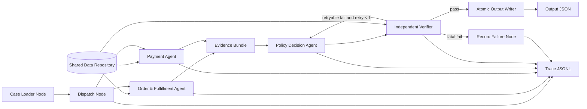

# KẾ HOẠCH TRIỂN KHAI DỰ ÁN

## Multi-Agent E-commerce Dispute Resolution

> Trạng thái lập kế hoạch: 05/08/2026. Nhóm 5 thành viên. Input chính thức hiện nằm tại `input/EC_001.json` đến `input/EC_050.json`.

## 1. Các quyết định đã chốt

| Hạng mục | Quyết định |
| --- | --- |
| Kiến trúc | Hybrid deterministic multi-agent |
| Orchestration | LangGraph `StateGraph`; DAG cố định; hai domain agent chạy song song |
| Domain agents | Order & Fulfillment Agent; Payment Agent |
| Decision | Policy Decision Agent gọi deterministic `EC_POLICY_V1` engine |
| Quality gate | Independent Verifier; chỉ output pass mới được ghi |
| Model chính | `qwen/qwen3.5-9b` qua OpenRouter |
| Giới hạn model | Mọi model `<= 10B`; không tự động fallback sang model khác |
| Tính tiền | `Decimal`, làm tròn 2 chữ số; model không tự cộng tiền |
| Structured data | Pydantic/JSON Schema cho input, handoff và output |
| Input chuẩn | `input/` ở root repo |
| Output | `output/EC_001.json` đến `output/EC_050.json` |
| Trace | Custom JSONL logger quanh mọi LangGraph node/tool/handoff; ghi mới `logging/trace.jsonl` cho lượt chạy gần nhất |
| Metadata | `logging/metadata.json` ghi model cho từng agent, parameter size, OpenRouter, LangGraph và runtime thật |

## 2. Kiến trúc triển khai



Nguyên tắc bắt buộc:

1. Agent có role, tool permission, input/output contract và trace riêng.
2. Shared Data Repository nạp/index CSV một lần cho toàn batch.
3. Không gửi nguyên CSV vào model; chỉ gửi row/fact của order đang xử lý.
4. Model chọn tool và dựng structured handoff; tool/code là nguồn dữ liệu và tính toán authoritative.
5. Policy engine trả rule đầu tiên khớp theo đúng priority.
6. Verifier không âm thầm sửa candidate; chỉ trả `pass` hoặc error codes.
7. LangGraph conditional edges kiểm soát pass/retry/fatal; không để agent loop vô hạn.
8. LangGraph checkpoint hỗ trợ khôi phục workflow, nhưng custom `trace.jsonl` vẫn là artifact chính thức để nộp.

## 3. Cấu trúc source dự kiến

```text
.
├── input/
│   └── EC_001.json ... EC_050.json
├── data/
│   └── olist_*.csv
├── output/
├── logging/
│   ├── trace.jsonl
│   └── metadata.json
├── src/
│   ├── __init__.py
│   ├── config.py
│   ├── schemas.py
│   ├── data_repository.py
│   ├── finance.py
│   ├── fulfillment.py
│   ├── policy.py
│   ├── evidence.py
│   ├── validator.py
│   ├── trace.py
│   ├── graph_state.py
│   ├── graph_nodes.py
│   ├── graph.py
│   ├── metadata.py
│   ├── audit_submission.py
│   ├── main.py
│   └── agents/
│       ├── base.py
│       ├── order_fulfillment.py
│       ├── payment.py
│       ├── policy_decision.py
│       └── verifier.py
├── tests/
│   ├── fixtures/
│   ├── test_data_repository.py
│   ├── test_finance.py
│   ├── test_fulfillment.py
│   ├── test_policy.py
│   ├── test_evidence.py
│   ├── test_validator.py
│   ├── test_graph.py
│   ├── test_trace_contract.py
│   ├── test_metadata_contract.py
│   └── test_e2e.py
├── .env.example
├── .gitignore
├── requirements.txt hoặc pyproject.toml
├── architecture.md
└── README.md
```

Thư viện tối thiểu đề xuất:

```text
openai
langgraph
langgraph-checkpoint-sqlite
pydantic
python-dotenv
pandas
pytest
pytest-asyncio
```

Sử dụng **LangGraph standalone** để orchestration; gọi OpenRouter bằng OpenAI-compatible SDK trực tiếp bên trong node. Chưa cần `create_agent()`/ReAct loop của LangChain, CrewAI, RAG hay LangSmith cloud. Business tools, JSONL trace và metadata vẫn tự triển khai để đúng schema nộp bài. Có thể bắt đầu bằng in-memory checkpointer; dùng SQLite checkpointer cho production batch nếu đã test resume thành công.

## 4. Phân công nhóm 5 người

| Thành viên | Ownership | File/module chính | Reviewer |
| --- | --- | --- | --- |
| 1 - Lead/Integrator | Config, LangGraph state/graph, runner, concurrency, trace, metadata, release | `config.py`, `graph_state.py`, `graph_nodes.py`, `graph.py`, `trace.py`, `main.py` | Thành viên 5 |
| 2 - Data & Order | Shared repository, index/join, order/item/seller facts | `data_repository.py`, phần order của agent | Thành viên 3 |
| 3 - Fulfillment/Delivery | Timestamp, delivery facts, seller/logistics attribution | `fulfillment.py`, phần fulfillment của agent | Thành viên 2 |
| 4 - Payment/Finance | Decimal totals, reconciliation, Payment Agent | `finance.py`, `agents/payment.py` | Thành viên 5 |
| 5 - Policy/QA | Policy engine, evidence builder, schemas, verifier, ZIP audit | `policy.py`, `evidence.py`, `schemas.py`, `validator.py` | Thành viên 1 |

Quy tắc phối hợp:

- Thành viên 1 và 5 chốt schema/contract trước khi các nhánh code bắt đầu.
- Thành viên 2 và 3 cùng sở hữu Order & Fulfillment Agent nhưng sửa các module khác nhau.
- Không merge module khi chưa có unit test và reviewer xác nhận.
- Mỗi thành viên lưu lệnh test và artifact để điền báo cáo cá nhân.

## 5. Kế hoạch từng bước

### Giai đoạn 0 — Chốt contract và vệ sinh repo

**Thời lượng:** 30–45 phút  
**Owner:** Thành viên 1 + 5  
**Phụ thuộc:** Không

- [ ] Tạo `.gitignore`: `.env`, `.DS_Store`, `.venv/`, `__pycache__/`, `.pytest_cache/` và file ZIP tạm.
- [ ] Xác nhận `input/` là nguồn input duy nhất; cập nhật tài liệu còn nhắc `data/input/`.
- [ ] Kiểm tra đủ 50 input, case ID liên tục, order ID không trùng và policy version hợp lệ.
- [ ] Chọn `requirements.txt` hoặc `pyproject.toml`; pin major/minor version cần thiết.
- [ ] Tạo `.env.example` chỉ có `OPENROUTER_API_KEY=`.
- [ ] Khai báo model trong source, không trong `.env`:

```python
OPENROUTER_MODEL = "qwen/qwen3.5-9b"
MODEL_PARAMETER_SIZE = "9B"
MODEL_PROVIDER = "OpenRouter"
MODEL_REGISTRY = {
    "order_fulfillment_agent": {"mode": "llm", "model": OPENROUTER_MODEL},
    "payment_agent": {"mode": "llm", "model": OPENROUTER_MODEL},
    "policy_decision_agent": {"mode": "llm", "model": OPENROUTER_MODEL},
    "verifier_agent": {"mode": "deterministic_only", "model": None},
}
```

- [ ] Chốt Pydantic schemas: input, task envelope, domain facts, candidate resolution, verifier result và final output.
- [ ] Chốt `CaseGraphState` cho LangGraph và reducer cho hai nhánh song song; state không chứa API key hoặc nguyên CSV.
- [ ] Chốt tên node/agent ổn định vì các tên này phải xuất hiện giống nhau trong source, trace, metadata và `architecture.md`.
- [ ] Chốt error codes như `ORDER_NOT_FOUND`, `PAYMENT_TOTAL_MISMATCH`, `INVALID_EVIDENCE_ID`, `POLICY_INVARIANT_FAILED`.
- [ ] Chốt quy tắc confidence. Đề không cung cấp công thức; mặc định đề xuất một giá trị deterministic cho case có đầy đủ dữ liệu và verifier pass, sau đó ghi rõ trong `architecture.md`. Không để model tự sinh khác nhau giữa các lần chạy.

**Đầu ra:** skeleton source, dependency file, `.gitignore`, `.env.example`, schema v1.  
**Nghiệm thu:** import project thành công; parse được cả 50 input; không có secret trong Git diff.

### Giai đoạn 1 — Shared Data Repository và deterministic tools

**Thời lượng:** 60 phút  
**Owner:** Thành viên 2, 3, 4 làm song song  
**Phụ thuộc:** Schema v1

#### Thành viên 2 — Data/order

- [ ] Chỉ nạp bốn bảng cần thiết: orders, order items, payments, sellers.
- [ ] Index theo `order_id`; seller index theo `seller_id`.
- [ ] Viết read-only methods: `get_order`, `get_items`, `get_payments`, `get_seller`.
- [ ] Chuẩn hóa ID nhưng giữ nguyên raw value để tạo evidence.
- [ ] Xử lý order không có item mà không coi là lỗi loader.

#### Thành viên 3 — Fulfillment

- [ ] Parse timestamp nhất quán; không đổi timezone.
- [ ] Viết `analyze_delivery(order, items)`.
- [ ] Trả các fact: delivered late/on time, carrier handoff late, violating seller IDs.
- [ ] Test equality boundary: `delivered == estimated` và `carrier == shipping_limit` không phải muộn.

#### Thành viên 4 — Finance

- [ ] Dùng `Decimal(str(value))`, không dùng float cho logic quyết định.
- [ ] Viết `calculate_item_total`, `calculate_freight_total`, `calculate_payment_total`.
- [ ] Viết reconciliation: `abs(payment - item - freight) <= Decimal("0.10")`.
- [ ] Không nhân `payment_value` với `payment_installments`.

**Đầu ra:** repository và deterministic tools có unit test.  
**Nghiệm thu:** các tổng và classification facts của 50 case khớp bảng oracle trong `BAO_CAO_PHAN_TICH_DE_TAI.md`.

### Giai đoạn 2 — Policy, evidence và verifier core

**Thời lượng:** 60 phút  
**Owner:** Thành viên 5  
**Phụ thuộc:** Domain fact schemas; có thể code bằng fixture trước khi Giai đoạn 1 hoàn tất

- [ ] Cài `EC_POLICY_V1` bằng `if/elif` hoặc rule table có priority cố định 1–6.
- [ ] Mapping cố định issue → root cause → party → refund source → action.
- [ ] Viết evidence builder chỉ nhận source references có thật.
- [ ] Viết final output builder với cap: entity 5, evidence 10, causes 3, parties 3, actions 5.
- [ ] Viết validator cho JSON Schema và referential integrity.
- [ ] Viết invariant validator:

```text
refund > 0  <=> action_required
refund == 0 <=> no_action
canceled/unavailable refund == payment total
late-delivery refund == freight total
no-action refund == 0
issue/cause/party/action đúng mapping
```

- [ ] Verifier trả error list; không tự sửa candidate.

**Đầu ra:** deterministic policy/evidence/validator với test cho 6 nhánh.  
**Nghiệm thu:** ít nhất một golden case mỗi issue pass; mutation cố ý về tiền/ID/action phải fail đúng error code.

### Giai đoạn 3 — OpenRouter agent nodes

**Thời lượng:** 60 phút  
**Owner:** Thành viên 1 tích hợp; thành viên 2, 4, 5 viết prompt/schema cho agent mình  
**Phụ thuộc:** Tool signatures và schemas ổn định

- [ ] Tạo OpenAI-compatible client với `base_url=https://openrouter.ai/api/v1`.
- [ ] Pin model slug `qwen/qwen3.5-9b` trong source.
- [ ] Tạo các async LangGraph node wrapper cho từng agent; node chỉ trả state update, không mutation state đầu vào.
- [ ] Cấu hình request mặc định:

```text
temperature = 0 hoặc mức thấp nhất provider chấp nhận
max_tokens = 300–800 tùy agent
response_format = json_schema
provider.require_parameters = true
provider.data_collection = deny
provider.allow_fallbacks = true  # chỉ fallback provider, không đổi model
```

- [ ] Không khai báo danh sách fallback model khác.
- [ ] Provider fallback chỉ được đổi endpoint cho cùng model slug; ghi requested model và returned model vào trace.
- [ ] Mỗi agent chỉ thấy tools thuộc quyền của mình.
- [ ] Order & Fulfillment Agent trả `OrderFulfillmentFacts`.
- [ ] Payment Agent trả `PaymentFacts`; mọi số tiền phải đến từ tool result.
- [ ] Policy Decision Agent bắt buộc gọi policy engine; không tự chọn issue bằng văn bản.
- [ ] Verifier Agent dùng code validator làm authoritative; model chỉ giải thích error code nếu cần.
- [ ] Validate tool arguments trước khi thực thi.
- [ ] Giới hạn tối đa 2 model turns/agent và 1 retry/case.
- [ ] Mỗi model call phải trả usage token và request/generation ID nếu OpenRouter cung cấp; không ghi prompt chứa secret.

**Đầu ra:** async LangGraph agent nodes và OpenRouter smoke test.  
**Nghiệm thu:** EC_001, EC_004, EC_005 chạy thành công; mọi response parse đúng schema; API key không xuất hiện trong log.

### Giai đoạn 4 — LangGraph orchestration, checkpoint và trace

**Thời lượng:** 45–60 phút  
**Owner:** Thành viên 1  
**Phụ thuộc:** Agent wrappers

- [ ] Định nghĩa `CaseGraphState` bằng `TypedDict`/Pydantic-compatible values:

```text
run_id, case_id, case_input, order_id
order_fulfillment_facts, payment_facts
candidate_resolution, verification_result
retry_count, errors, output_path
```

- [ ] Tạo `StateGraph` với node ổn định: `load_case`, `order_fulfillment_agent`, `payment_agent`, `join_facts`, `policy_decision_agent`, `verifier_agent`, `write_output`, `record_failure`.
- [ ] Tạo parallel edges từ `load_case` đến hai domain agent; dùng reducer/state keys phù hợp để kết quả không ghi đè nhau.
- [ ] `join_facts` chỉ cho đi tiếp khi cả hai domain bundle hợp lệ.
- [ ] Conditional edge sau Verifier: `pass -> write_output`, `retryable && retry_count < 1 -> policy_decision_agent`, còn lại `record_failure`.
- [ ] Có START/END rõ ràng; compile graph một lần, không compile lại mỗi case.
- [ ] Batch runner dùng `graph.ainvoke()` và semaphore 3–5 case đồng thời; graph tự xử lý parallel nodes bên trong case.
- [ ] Gán `thread_id = <run_id>:<case_id>` cho checkpointer; test rằng resume không chạy lại node đã hoàn tất.
- [ ] Chỉ ghi output khi Verifier pass.
- [ ] Atomic write: ghi file tạm cùng thư mục rồi replace file đích.
- [ ] Truncate `logging/trace.jsonl` đúng một lần ở đầu production batch; không truncate trong từng case/node.
- [ ] Bọc mọi graph node và tool bằng trace decorator/context manager; logger phải concurrency-safe.
- [ ] Mỗi trace event có tối thiểu:

```text
schema_version, timestamp, run_id, case_id, event_id, parent_event_id
event_type, node, agent, producer, consumer
requested_model, returned_model, parameter_size, provider
input_artifact_ids, output_artifact_ids, tool_name
started_at, finished_at, latency_ms
prompt_tokens, completion_tokens, reasoning_tokens, total_tokens
retry_count, status, error_code, error_message_sanitized
```

- [ ] Event types tối thiểu: `run_started`, `case_started`, `node_started`, `tool_called`, `tool_completed`, `handoff`, `model_completed`, `verification_completed`, `output_written`, `case_completed`, `run_completed`.
- [ ] `handoff` phải ghi producer/consumer và artifact IDs để chứng minh giao tiếp agent-to-agent.
- [ ] `model_completed` phải ghi chính xác `qwen/qwen3.5-9b`; nếu returned model khác slug/size đã cho phép thì fail run.
- [ ] Giới hạn concurrency API ban đầu ở 3–5 request; retry 429/5xx bằng exponential backoff có jitter.
- [ ] Không retry validation/business error như order không tồn tại.

**Đầu ra:** compiled LangGraph, checkpointer, batch runner, trace writer và retry policy.  
**Nghiệm thu:** chạy 5 case song song không race condition; graph visualization đúng kiến trúc; trace liên kết được mọi node/tool/handoff/model call của từng case; resume test pass.

### Giai đoạn 5 — Test tích hợp và benchmark model

**Thời lượng:** 60–90 phút  
**Owner:** Cả nhóm; thành viên 5 điều phối QA  
**Phụ thuộc:** End-to-end pipeline

- [ ] Chạy unit test toàn bộ module.
- [ ] Test graph topology: đúng node, edge song song, conditional retry và END path.
- [ ] Test trace contract: mọi dòng là JSON hợp lệ, đủ required fields, event/parent IDs liên kết được và không có secret.
- [ ] Test metadata contract: model/parameter/framework/runtime khớp constants và production trace.
- [ ] Chạy 6 representative cases, mỗi issue một case.
- [ ] Chạy edge cases:
  - [ ] 8 unavailable case không có item.
  - [ ] EC_025 và EC_029 có 3 item.
  - [ ] EC_030 có 3 payment rows.
  - [ ] EC_008 canceled nhưng có carrier timestamp bất thường; canceled rule vẫn ưu tiên.
- [ ] Chạy đủ 50 case hai lần vào hai thư mục tạm.
- [ ] So sánh semantic JSON; bỏ qua timestamp/trace metadata khi kiểm tra reproducibility.
- [ ] Đo:

```text
primary issue accuracy so với oracle
financial accuracy
schema first-pass rate
tool-call success rate
retry count
evidence false-positive count
p50/p95 latency
prompt/completion tokens
estimated và actual OpenRouter cost
```

- [ ] Chỉ cân nhắc đổi sang `qwen/qwen3-8b` nếu Qwen3.5-9B không đạt tool/schema reliability. Nếu đổi, cập nhật source, metadata và chạy lại toàn bộ benchmark; không trộn model giữa hai lượt.

**Release gate:** 50/50 case đúng issue và financial oracle; 0 invalid evidence; 0 schema error; hai lần chạy có kết quả nghiệp vụ giống nhau.

### Giai đoạn 6 — Chạy production batch

**Thời lượng:** 20–30 phút  
**Owner:** Thành viên 1 + 5  
**Phụ thuộc:** Release gate pass

- [ ] Xóa output JSON của lượt test theo cách có kiểm soát; giữ `.gitkeep` nếu cần.
- [ ] Chạy đúng một batch chính thức với input `input/`.
- [ ] Ghi mới `logging/trace.jsonl`.
- [ ] Điền `logging/metadata.json` từ runtime thật, không dùng placeholder.
- [ ] Xác nhận mọi `model_completed` event có `requested_model = qwen/qwen3.5-9b` và parameter size không vượt 10B.
- [ ] Xác nhận trace có đủ 50 `case_started`, 50 `case_completed`, một `run_started`, một `run_completed` và không lẫn run ID cũ.
- [ ] Chạy standalone validator trên 50 output.
- [ ] Khóa output chính thức; mọi sửa code sau đó phải chạy lại batch và trace.

Metadata tối thiểu:

```json
{
  "schema_version": "1.0",
  "run_id": "<actual-run-id>",
  "model": "qwen/qwen3.5-9b",
  "parameter_size": "9B",
  "provider": "OpenRouter",
  "agents": {
    "order_fulfillment_agent": {
      "mode": "llm_with_deterministic_tools",
      "model": "qwen/qwen3.5-9b"
    },
    "payment_agent": {
      "mode": "llm_with_deterministic_tools",
      "model": "qwen/qwen3.5-9b"
    },
    "policy_decision_agent": {
      "mode": "llm_with_deterministic_policy_engine",
      "model": "qwen/qwen3.5-9b"
    },
    "verifier_agent": {
      "mode": "deterministic_only",
      "model": null
    }
  },
  "framework": "LangGraph StateGraph + OpenAI-compatible SDK",
  "framework_versions": {
    "langgraph": "<actual-version>",
    "openai": "<actual-version>",
    "pydantic": "<actual-version>"
  },
  "policy_version": "EC_POLICY_V1",
  "runtime": "Python <actual-version>",
  "started_at": "<actual-timestamp>",
  "finished_at": "<actual-timestamp>",
  "case_count": 50,
  "successful_case_count": 50,
  "trace_path": "logging/trace.jsonl"
}
```

Không hardcode version/timestamp/run statistics giả; runtime tự thu thập và ghi metadata sau khi batch hoàn tất. Nếu Verifier Agent không gọi model trong implementation cuối, ghi rõ mode `deterministic_only` cho agent đó thay vì tạo một model call giả.

**Nghiệm thu:** đúng 50 JSON, trace của đúng run ID, metadata khớp source, dependency lock và trace; audit script trả exit code 0.

### Giai đoạn 7 — Hoàn thiện tài liệu cá nhân và kiến trúc

**Thời lượng:** 30–45 phút  
**Owner:** Cả nhóm  
**Phụ thuộc:** Production batch

- [ ] Cập nhật `architecture.md` theo code đã chạy thật: diagram, roles, permissions, handoff, retry và verifier.
- [ ] Xuất graph/node-edge diagram từ compiled LangGraph hoặc đối chiếu tự động để sơ đồ trong `architecture.md` không lệch source.
- [ ] Đồng bộ README và báo cáo tổng hợp với input path `input/`.
- [ ] Sửa phần câu hỏi Crossref/vector index sai đề trong template báo cáo cá nhân.
- [ ] Mỗi thành viên tạo một file báo cáo riêng tại root.
- [ ] Mỗi báo cáo ghi file/hàm thực làm, lệnh test, kết quả và artifact/trace làm bằng chứng.
- [ ] Không sao chép nguyên báo cáo chung hoặc báo cáo của nhau.

**Nghiệm thu:** có đủ 5 báo cáo cá nhân, không còn placeholder, nội dung khớp Git history và trace.

### Giai đoạn 8 — Git audit, đóng gói và nộp

**Thời lượng:** 20–30 phút  
**Owner:** Thành viên 1 + 5  
**Phụ thuộc:** Tất cả artifact hoàn tất

- [ ] Chạy test và validator lần cuối.
- [ ] Review `git status`, diff và file untracked.
- [ ] Loại `.DS_Store`; kiểm tra `.env` không được track.
- [ ] Quét chuỗi giống API key/secret; che secret trong trace/error.
- [ ] Commit và push toàn bộ source/tài liệu bắt buộc trước khi nộp ZIP.
- [ ] Giữ nguyên tên repo.
- [ ] Tạo ZIP chỉ từ 50 JSON:

```bash
(cd output && zip -q ../output.zip EC_*.json)
```

- [ ] Kiểm tra:

```bash
unzip -Z1 output.zip | wc -l
unzip -t output.zip
```

- [ ] Danh sách ZIP phải đúng `EC_001.json` ... `EC_050.json`, không có `.gitkeep`, code, log, `.env` hoặc thư mục con.

## 6. Submission observability contract

Phần này là yêu cầu bắt buộc của code, không chỉ là mô tả tài liệu.

### 6.1. Single source of truth cho model

- Tên model chỉ có một constant authoritative: `qwen/qwen3.5-9b` trong `src/config.py`.
- Agent registry tham chiếu constant này, không chép string rải rác.
- `.env` chỉ chứa `OPENROUTER_API_KEY`; tuyệt đối không chứa model name.
- Metadata được sinh từ config/runtime; trace lấy model name trực tiếp từ request/response object.
- Startup assertion từ chối model có parameter size lớn hơn 10B hoặc model slug không nằm trong allowlist.
- Không dùng OpenRouter auto-model/router hoặc fallback model; chỉ cho phép fallback provider của cùng slug.

### 6.2. Trace chính thức

`logging/trace.jsonl` phải:

1. Chứa duy nhất lượt production run mới nhất.
2. Mỗi dòng là một JSON object độc lập, UTF-8, không markdown và không stack trace thô.
3. Có `schema_version` để validator biết contract.
4. Có run/case/event/parent IDs để dựng lại cây thực thi.
5. Ghi đủ LangGraph node transition, model call, tool call, handoff, verification và output write.
6. Ghi usage/token/latency từ response thật; field không có dữ liệu dùng `null`, không bịa số.
7. Không ghi API key, authorization header, `.env`, full prompt chứa secret hoặc PII không cần thiết.
8. Có event kết thúc xác nhận case/run thành công hoặc thất bại.

### 6.3. Operational log

Có thể ghi thêm `logging/run.log` cho người phát triển, nhưng:

- Không thay thế `trace.jsonl`.
- Dùng structured hoặc concise text log; che secret và authorization header.
- Có log level, timestamp, run ID, case ID và node.
- Không đưa `run.log`, checkpoint database hoặc LangSmith artifact vào `output.zip`.
- Nếu không cần operational log thì console logging là đủ; file bắt buộc của đề vẫn là trace và metadata.

### 6.4. Metadata chính thức

`logging/metadata.json` phải được runtime tạo từ dữ liệu thật và nhất quán với:

- `src/config.py` về model/provider/parameter size.
- Dependency lock về framework versions.
- `trace.jsonl` về run ID, thời gian, số case và agent model.
- Source architecture về tên agent/node.

### 6.5. Audit tự động trước submit

Tạo `src/audit_submission.py` để fail nếu:

```text
model name thiếu hoặc khác giữa source/metadata/trace
parameter size > 10B
framework không ghi LangGraph/runtime version
trace chứa nhiều run_id hoặc thiếu event bắt buộc
trace có case thiếu node/handoff/verification/output event
trace/metadata chứa chuỗi giống API key
output không đúng 50 JSON hoặc không pass schema/invariant
ZIP chứa artifact ngoài EC_001.json ... EC_050.json
```

Audit phải chạy độc lập sau production batch và trước khi tạo ZIP.

## 7. Thứ tự tích hợp Git

```text
1. contract/schema branch
2. data repository + order branch
3. fulfillment branch
4. finance/payment branch
5. policy/verifier branch
6. LangGraph agent nodes + graph orchestration branch
7. integration fixes
8. production output + documentation
9. release tag/commit
```

Mỗi nhánh nên rebase/merge sau khi schema v1 được chốt. Thay đổi schema sau đó phải tăng contract version hoặc được toàn bộ consumer cập nhật trong cùng PR.

## 8. Critical path và công việc song song

```text
Contract/schema
   ├── Data/Order ───────┐
   ├── Fulfillment ──────┤
   ├── Payment ──────────┼→ Agent nodes → Compiled LangGraph → E2E → Batch → Submit
   └── Policy/Verifier ──┘
```

Critical path là `schema/state → agent nodes → compiled LangGraph → E2E → production batch`. Ba module domain và policy có thể phát triển song song sau khi contract chốt.

Ước lượng elapsed time nếu phối hợp tốt: khoảng 5–7 giờ làm việc tập trung; tổng person-hours lớn hơn do 5 người làm song song. Nếu chỉ còn khung competition 3 giờ, phải ưu tiên theo thứ tự P0:

1. Schema + deterministic repository/tools.
2. Policy + verifier.
3. Minimal LangGraph agent nodes + handoff + custom trace.
4. 50 output correctness.
5. Architecture/metadata/report.
6. Benchmark mở rộng và tối ưu latency làm sau nếu còn thời gian.

## 9. Definition of Done

- [ ] Có LangGraph multi-agent thật với node/edge/state, role/tool/contract/handoff/trace riêng.
- [ ] Model được pin là `qwen/qwen3.5-9b`, dưới 10B và khai báo trong source/metadata.
- [ ] API key chỉ tồn tại trong `.env` hoặc environment, không vào Git/log.
- [ ] Policy, tiền, timestamp và validation chạy deterministic.
- [ ] 50/50 case pass oracle nghiệp vụ và standalone validator.
- [ ] 0 evidence ID không tồn tại; 0 schema/hard-gate violation.
- [ ] Hai lượt chạy cho semantic output giống nhau.
- [ ] `architecture.md`, metadata, trace và 5 báo cáo cá nhân hoàn chỉnh.
- [ ] Trace/metadata audit pass; model name và parameter size nhất quán trong source, request, trace và metadata.
- [ ] Source đã commit/push; repo giữ nguyên tên.
- [ ] ZIP có đúng 50 JSON và đã kiểm tra integrity.
