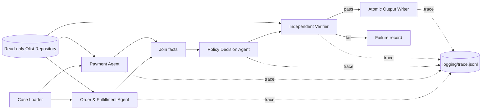

# Kiến trúc triển khai — Multi-Agent E-commerce Dispute Resolution

## Mục tiêu

Hệ thống xử lý mỗi `EC_*.json` bằng một workflow LangGraph có các domain agent độc lập, sau đó áp dụng policy và kiểm chứng độc lập trước khi ghi output. Thiết kế ưu tiên tính đúng đắn, khả năng audit và tính tái lập hơn việc để LLM tự suy luận số tiền/trách nhiệm.



## Agent contract và quyền truy cập

| Node/agent | Input | Quyền dữ liệu/tool | Output/handoff | Vai trò |
| --- | --- | --- | --- | --- |
| Case Loader | JSON case | Đọc `input/` | case đã Pydantic-validate, `order_id` | Khởi tạo trace và xác định order cần điều tra. |
| Order & Fulfillment | `order_id` | Chỉ đọc `orders`, `order_items`, `sellers` | status, item/seller, deadlines, late flags | Phân biệt seller handoff muộn với giao muộn. |
| Payment | `order_id` | Chỉ đọc `order_payments`, `order_items` | payment rows, total, reconciliation delta | Cộng payment rows và đối soát item + freight. |
| Policy Decision | Hai fact bundle | Deterministic `EC_POLICY_V1` engine | candidate `ResolutionOutput` | Áp dụng rule theo thứ tự ưu tiên, không để model tự tính tiền. |
| Verifier | candidate + facts | Read-only repository, schema/evidence validators | pass/fail + error code | So khớp policy, money invariant, evidence tồn tại và output schema. |
| Atomic Writer | candidate đã pass | Ghi duy nhất `output/EC_*.json` | file JSON | Ghi tạm rồi rename để không có file dở dang. |

## Cơ chế model

Model đã khai báo trong source là `qwen/qwen3.5-9b` qua OpenRouter (9B, dưới giới hạn 10B). Khi chạy `--use-llm`, ba domain/policy agents gọi model với facts đã được tool/code xác thực; lời gọi chỉ là audit/diễn giải có trace, không thể ghi đè facts, rule, evidence hay tính tiền. Verifier luôn deterministic và không dùng model.

Khi chưa có `OPENROUTER_API_KEY`, lệnh không có `--use-llm` chạy chế độ deterministic để regression test. Metadata ghi rõ `llm_enabled: false`; không được xem đây là trace LLM production.

## Bảo đảm correctness và audit

- Dùng `Decimal` và lượng tử hóa tiền về 2 chữ số; ngưỡng reconciliation là `<= 0.10` BRL.
- Rule được xét tuần tự: canceled → unavailable → seller late → logistics late → split payment → reject claim.
- Evidence chỉ sinh theo format đề bài và được resolver kiểm tra tồn tại trong CSV.
- `case_status == action_required` khi và chỉ khi refund dương.
- `logging/trace.jsonl` bị ghi mới cho mỗi batch, event có `run_id`, case, agent, source refs, verification và output path; secret không được log.
- `logging/metadata.json` lưu provider, model, parameter size, framework, Python runtime và model registry từng agent.

## Vận hành

```bash
python3.11 -m venv .venv
.venv/bin/python -m pip install -r requirements.txt
.venv/bin/python -m pytest -q
.venv/bin/python -m src.main --max-concurrency 4
.venv/bin/python -m src.main --audit-only
```

Để chạy với OpenRouter, tạo `.env` từ `.env.example`, đặt `OPENROUTER_API_KEY`, sau đó thêm cờ `--use-llm`. Chỉ zip đúng 50 JSON trong `output/` để nộp; source, `.env` và logging không nằm trong zip.
